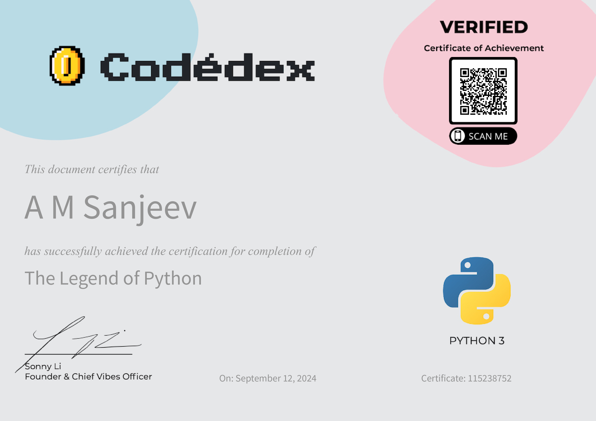
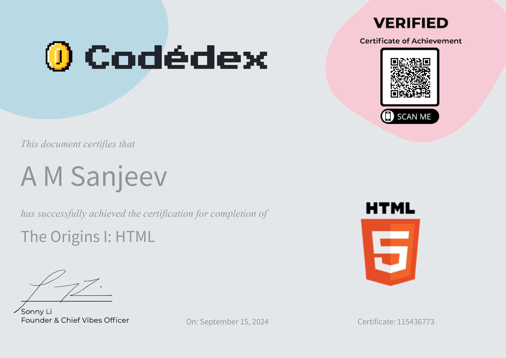

#  The Legend of Python 


Welcome to the **The Legend of Python** repository! This collection features basic Python projects I created while revising my skills through the [**Codédex**](https://www.codedex.io/) course: **The Legend of Python**.

## Course Overview

### Codédex - The Legend of Python

- **Platform:** [Codédex](https://www.codedex.io/)

### Course Features

- **Tasks:** Complete tasks to gain XP and badges
- **Projects:** Build projects as you progress through the course
- **Community:** Engage with the Codédex community for support and inspiration


## Repository Contents

This repository includes the following projects:

1. **Terminal Adventure**
2. 


## Getting Started

To run these projects on your local machine:

1. Clone this repository:
   ```bash
   git clone https://github.com/AMSANJEEV28/Python_Rev..git

2. Navigate to the project directory:
   ```bash
   cd legend-of-python-projects

3. Run the Python scripts:
   ```bash
   python3 project_name.py

## Requirements

1. Python 3.x installed on your machine
2. Basic understanding of Python syntax and concepts

## Contributing

If you would like to contribute or suggest improvements, feel free to fork this repository, make your changes, and submit a pull request. Contributions are always welcome!

 


## CODEDEXX HTML

 

